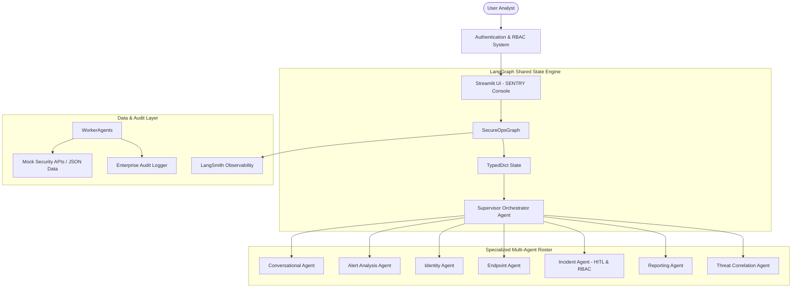

# 🛡️ SecureOps AI (SENTRY) – Agentic Multi-Agent SOC Copilot Platform

> **SENTRY** — *Security Engine for Next-generation Triage, Recommendations & Yield*

SecureOps AI (SENTRY) is an enterprise-grade AI Security Operations Center (SOC) Copilot built using **Python, LangGraph, LangChain, Streamlit, and LangSmith**.

---

## 📐 Core Architecture & Multi-Agent Design

SENTRY features a **true LangGraph multi-agent state graph** where an LLM-powered Supervisor Orchestrator dynamically plans, routes, and coordinates specialized worker agents:



---

## 🔐 Enterprise Role-Based Access Control (RBAC) Matrix

| User Role | Username / Pass | Key Capabilities & Authorization Scope |
|---|---|---|
| **L1 SOC Analyst** | `analyst_l1` / `l1pass123` | Search SIEM alerts, inspect user logs, view endpoint status. Cannot create/escalate incidents. |
| **L2 SOC Analyst** | `analyst_l2` / `l2pass123` | Deep investigations, Threat Hunting, multi-event correlation, analyst handoffs, reports. |
| **SOC Manager** | `manager` / `mgrpass123` | Incident creation/escalation approval (HITL), host containment authorization, incident management. |
| **CISO Executive** | `ciso` / `cisopass123` | Executive CISO summaries, organizational risk posture, attack campaign trends. |
| **Security Administrator**| `admin` / `adminpass123` | System configuration, user governance, enterprise compliance audit log inspection. |

---

## 🚀 Quick Start & Installation

### 1. Requirements & Dependencies
- Python 3.10+
- Ollama (Optional for local Llama 3.2 execution)

```bash
git clone https://github.com/Aryagithubk/GL-Context-AI.git
cd SecureOps-AI
python -m venv venv
venv\Scripts\activate  # On Windows
pip install -r requirements.txt
```

### 2. Environment Configuration (`.env`)
```ini
LLM_PROVIDER=ollama
OLLAMA_MODEL=llama3.2:latest
OLLAMA_BASE_URL=http://localhost:11434

LANGSMITH_TRACING=true
LANGSMITH_PROJECT=SecureOps-AI
LANGSMITH_API_KEY=lsv2_pt_your_api_key_here
```

### 3. Running the Streamlit App
```bash
streamlit run app.py
```
Open **`http://localhost:8501`** in your browser.

---

## 🧪 Running Unit Tests & Benchmark Evaluation

### Pytest Unit Test Suite
```bash
python -m pytest tests/
```

### LangSmith Benchmark Evaluation Dataset
```bash
python evaluation/evaluate.py
```

---

## 🌟 Key Differentiating Features
1. **True LangGraph Agentic Orchestration**: Dynamic multi-step agent coordination.
2. **Role-Aware AI Assistant & Authorization**: Prevents unauthorized destructive actions at agent & tool boundary.
3. **Human-in-the-Loop Safeguards**: Pauses workflow before creating/escalating critical security incidents.
4. **Phase 2 Threat Correlation & Attack Chain**: Visual node graphs (`C2 IP → Brute Force → Host Infection → Ransomware`).
5. **SOC Copilot Workspace**: Dedicated investigation card, timeline, analyst handoffs, and Q&A.
6. **Enterprise Audit Logging**: Compliance audit tracking separate from LangSmith.
7. **Full LangSmith Observability**: End-to-end tracing across orchestrator, agents, and tools.
