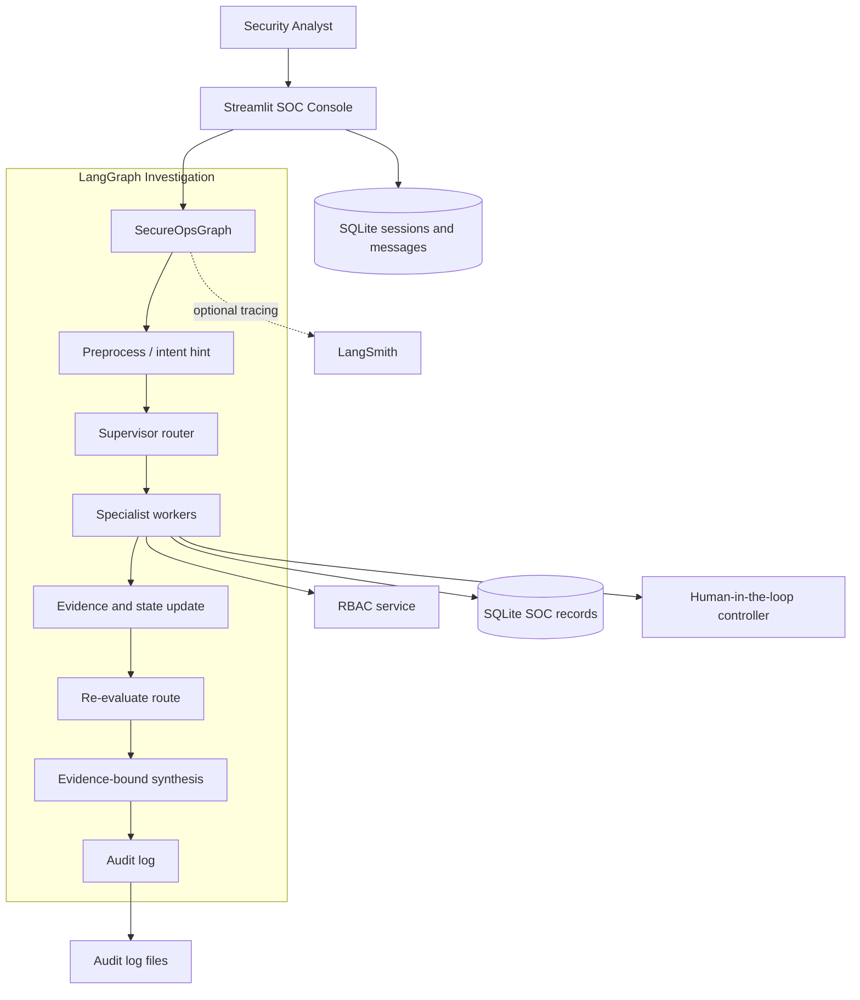
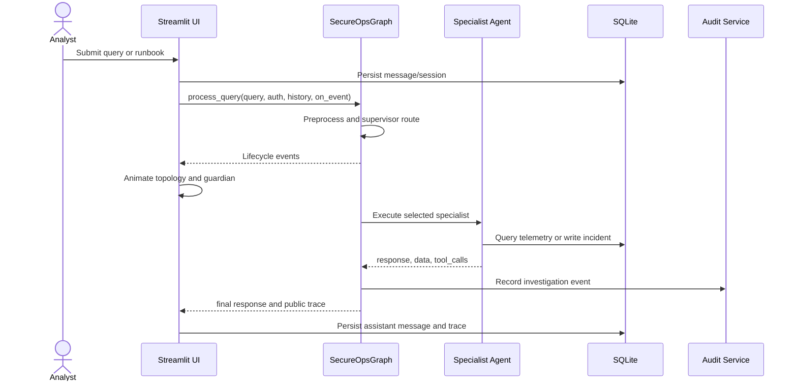
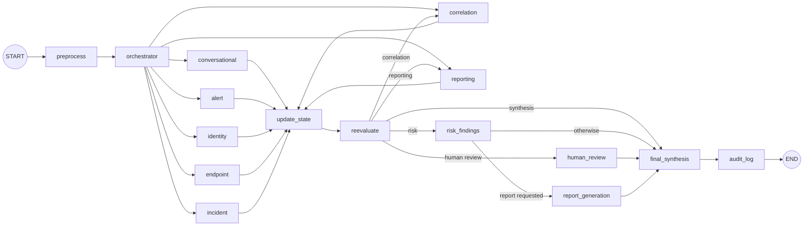
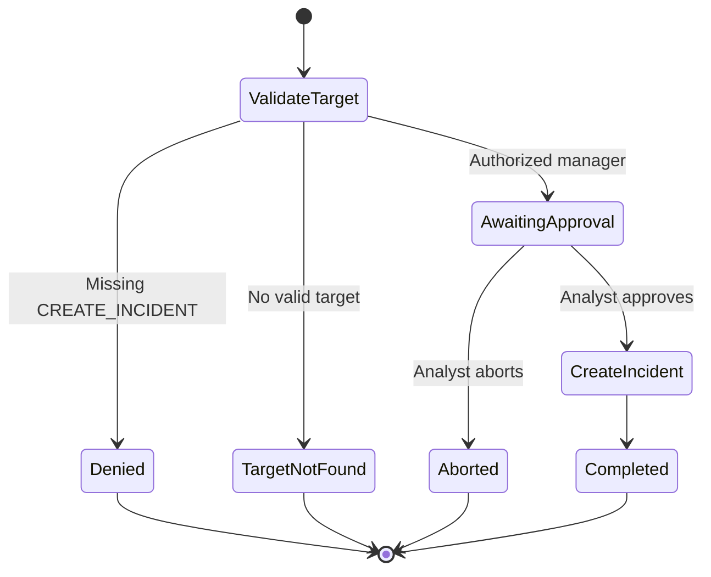
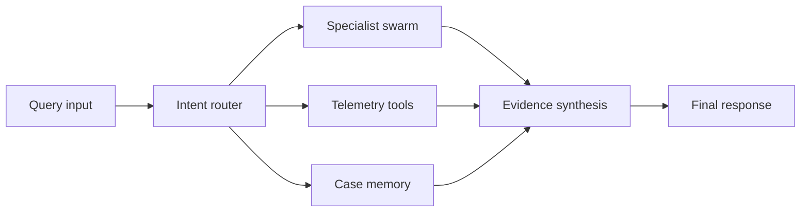

# SENTRY AI — Project Documentation

> **SENTRY** is the Security Engine for Next-generation Triage, Recommendations & Yield: a Streamlit SOC copilot built with LangGraph, specialist agents, SQLite-backed demo telemetry, RBAC, and human approval gates.

## Overview

SENTRY accepts an analyst request, restores its conversation context where appropriate, chooses a specialist through a LangGraph workflow, gathers evidence, applies role authorization, and returns an auditable response. The UI projects the live backend event stream as a branching SOC execution topology.

| Capability | Implementation |
|---|---|
| General SOC assistance | `ConversationalAgent` with conversation history |
| Alert triage | `AlertAgent` and `search_alert` |
| Identity/login investigation | `IdentityAgent` and `search_user` |
| Endpoint investigation | `EndpointAgent` and `check_endpoint` |
| Threat correlation | `CorrelationAgent`, RBAC protected |
| Incident creation | `IncidentAgent`, RBAC + HITL protected |
| Evidence reports | `ReportingAgent` |
| Audit and tracing | `AuditService` and optional `LangSmithService` |

## System architecture



### Design principles

1. **Stateful orchestration**: `SecureOpsGraph` owns the investigation lifecycle rather than using one prompt.
2. **Evidence-aware agents**: responses carry public text, structured data, and tool metadata.
3. **Authorization at action boundaries**: sensitive operations are checked in agents, not only hidden in UI.
4. **Operational, not private, tracing**: users see stage, agent, tool, decision, and status metadata—not model chain-of-thought.
5. **Offline-capable demo**: unavailable LLM integrations fall back to a mock LLM.

## Request lifecycle



Session restoration uses the `session` query parameter and the `app_sessions` table. `SecureOpsGraph._apply_conversation_context()` resolves follow-up references such as “check that host” from the newest explicit user-mentioned hostname, IP address, or email address. Explicit entities in the new message always take precedence.

## LangGraph workflow

`backend/workflows/graph.py` compiles the following graph.



| Stage | Node | Responsibility |
|---:|---|---|
| 1 | `preprocess` | Intent hint, required evidence, and role permissions. |
| 2 | `orchestrator` | Supervisor selects an agent and routing rationale. |
| 3 | Worker node | Runs conversational, alert, identity, endpoint, incident, correlation, or reporting work. |
| 4 | `update_state` | Adds tool/evidence metadata and pending HITL details. |
| 5 | `reevaluate` | Routes to correlation, risk, HITL, reporting, or synthesis. |
| 6 | `risk_findings` / `human_review` | Derives evidence risk or enters approval-required state. |
| 7 | `report_generation` | Generates a terminal report for explicit report requests. |
| 8 | `final_synthesis` | Returns the primary evidence-bound result. |
| 9 | `audit_log` | Writes the compliance investigation event. |

`SecureOpsState` carries query and user context, role permissions, selected/active agent, agent outputs, tool outputs, evidence, risk assessment, HITL state, trace, audit entries, response, and result status.

## Agent roster

| Agent | Typical route | Data or action |
|---|---|---|
| `ConversationalAgent` | General SOC question | Uses conversation history; no telemetry tool. |
| `AlertAgent` | Alert/SIEM query | Searches alerts. |
| `IdentityAgent` | User/login query | Searches identity records and login history. |
| `EndpointAgent` | Host investigation | Checks endpoint records. |
| `IncidentAgent` | Create or escalate incident | Requires permission and explicit approval. |
| `CorrelationAgent` | Cross-domain threat hunt | Requires correlation permission. |
| `ReportingAgent` | Incident/executive report | Uses incident and correlation evidence. |
| `SupervisorAgent` | Every request | Selects specialist; falls back to algorithmic classification. |

### LLM providers

| Provider value | Implementation | Fallback |
|---|---|---|
| `mock` | Offline `MockLLMEngine` | Default deterministic mode. |
| `ollama` / `llama3.2` | `ChatOllama` | Mock if unavailable. |
| `gemini` | `ChatGoogleGenerativeAI` | Mock if unavailable or keyless. |
| `openai` | LangChain `ChatOpenAI` | Mock if unavailable or keyless. |

## Security model

The permission source of truth is `backend/services/rbac_service.py`.

| Capability | L1 | L2 | Manager | CISO | Admin |
|---|:---:|:---:|:---:|:---:|:---:|
| View alerts/incidents | Yes | Yes | Yes | Yes | Yes |
| Search users/login telemetry | Yes | Yes | Yes | No | Yes |
| Check endpoint telemetry | Yes | Yes | Yes | No | Yes |
| Threat hunting/correlation | No | Yes | Yes | No | No |
| Generate reports | No | Yes | Yes | Yes | No |
| Investigation handoff/Q&A | No | Yes | Yes | No | No |
| Create/escalate incident | No | No | Yes | No | No |
| Approve sensitive actions | No | No | Yes | No | No |
| View audit logs | No | No | No | No | Yes |

An RBAC denial is terminal during graph re-evaluation: SENTRY does not call another agent or LLM to bypass a denied action.



## Data, persistence, and audit

`DatabaseService.initialize_database()` creates `mock_data/secureops.db`. Bundled JSON under `mock_data/` seeds a data domain only when it is empty.

| Store | Purpose |
|---|---|
| `users` | Demo users, role assignment, and password hashes. |
| `soc_records` | JSON telemetry for alerts, identities, endpoints, logins, threat intel, and incidents. |
| `app_sessions` | Restorable authenticated session payload. |
| `conversation_messages` | Ordered messages and public traces per session. |
| `logs/audit.log` | Human-readable audit log. |
| `logs/audit_records.json` | Newest 500 structured audit records. |

`SOCApiClient` provides normalized token matching and limited fuzzy matching over SQLite records. It is a local demonstration adapter, not a real SIEM/EDR integration.

LangSmith tracing is disabled unless a tracing flag and API key are present. When active, graph runs include role and provider metadata.

## UI and visual design

| Surface | Purpose |
|---|---|
| Login | Role-bound authentication and persistent session creation. |
| Sidebar | Navigation, provider choice, posture counts, and runbooks. |
| SENTRY Console | Persistent messages, execution traces, and HITL dialog. |
| Execution topology | Live projection of the backend event stream. |
| SENTRY guardian | Floating Three.js companion with SVG fallback. |
| Workspace/dashboards/audit | Investigation, role-specific operations, and compliance views. |

`frontend/styles.py` defines the glass-console system: deep-space `#06090E`, translucent panels (`rgba(13, 19, 31, 0.70)`), 12px backdrop blur, cyan active state `#00F0FF`, emerald completion `#00FF66`, crimson error `#FF3366`, Inter UI type, and JetBrains Mono operational type.



`frontend/execution_visualizer.py` builds this topology as server-rendered SVG, which keeps it visible if client scripts or CDN assets cannot load. It maps actual graph events as follows:

| Event | Visual state |
|---|---|
| `node_started` | Running branch, named specialist detail, cyan pulses. |
| `tool_completed` | Completed telemetry operation and tool name. |
| `node_completed` | Emerald completed branch. |
| `node_waiting` | Crimson attention/error state for authorization. |

The Specialist Swarm panel uses actual stage-2 actor names and details. The guardian listens to pointer movement from the containing app document, so it reacts anywhere on the screen. It increases emission and pulse speed while the execution state is active; an SVG fallback remains visible if Three.js cannot load.

## Setup and configuration

### Prerequisites

- Python 3.10+
- Packages in `requirements.txt`
- Optional: Ollama and/or LangSmith credentials

```bash
python3 -m venv .venv
source .venv/bin/activate
pip install -r requirements.txt
streamlit run app.py
```

Streamlit normally serves the application at `http://localhost:8501`.

Create `.env` for external models or tracing:

```ini
LLM_PROVIDER=mock
OLLAMA_MODEL=llama3.2
OLLAMA_BASE_URL=http://localhost:11434
GOOGLE_API_KEY=
OPENAI_API_KEY=
GEMINI_MODEL=gemini-1.5-flash
OPENAI_MODEL=gpt-4o-mini
LANGSMITH_TRACING=false
LANGSMITH_PROJECT=SecureOps-AI
LANGSMITH_API_KEY=
```

### Demo accounts

| Role | Username | Password |
|---|---|---|
| L1 SOC Analyst | `analyst_l1` | `l1pass123` |
| L2 SOC Analyst | `analyst_l2` | `l2pass123` |
| SOC Manager | `manager` | `mgrpass123` |
| CISO | `ciso` | `cisopass123` |
| Administrator | `admin` | `adminpass123` |

## Testing

```bash
python3 -m pytest tests/
```

| Test module | Focus |
|---|---|
| `test_agents.py` | Routing, specialists, HITL, end-to-end graph behavior. |
| `test_graph.py` | Conversation, alert, RBAC, incident, and correlation routes. |
| `test_tools.py` | Alert, identity, endpoint, indicator, and incident operations. |
| `test_rbac.py` | Authentication, permissions, authorization, and audit. |
| `test_session_persistence.py` | SQLite persistence and follow-up context. |
| `test_langsmith.py` | Opt-in tracing and metadata. |

`evaluation/` contains the evaluation dataset and LangSmith-oriented material. Run `python3 evaluation/evaluate.py` when the evaluation environment is configured.

## Production boundaries

SENTRY is a demo/reference SOC copilot. Before using real telemetry or exposing it to real users:

1. Replace demo credentials and SHA-256 password handling with SSO or modern salted password hashing.
2. Replace query-parameter session restoration with hardened expiring cookies or enterprise SSO.
3. Replace local adapters with authenticated SIEM, EDR, IAM, ticketing, and asset-system connectors.
4. Apply retention, encryption, access control, and secret management to telemetry, logs, SQLite data, and external traces.
5. Add deployment hardening, rate limits, monitoring, and request validation.
6. Keep human approval for impactful security changes; generated results are analyst assistance, not autonomous remediation.

## Repository map

| Path | Responsibility |
|---|---|
| `app.py` | Streamlit entry point. |
| `frontend/ui.py` | Shell, session flow, and live execution binding. |
| `frontend/execution_visualizer.py` | SVG topology and WebGL guardian. |
| `frontend/styles.py` | Glass-console visual system. |
| `backend/workflows/graph.py` | LangGraph workflow and UI event emission. |
| `backend/workflows/state.py` | Shared workflow state schema. |
| `backend/agents/` | Supervisor and specialist agents. |
| `backend/tools/` | Agent tool adapters. |
| `backend/services/` | Auth, RBAC, DB, API, audit, correlation, LLM, LangSmith. |
| `mock_data/` | Seed JSON and generated SQLite database. |
| `tests/` | Pytest coverage. |
| `docs/` | Existing architecture, workflow, presentation, and evaluation assets. |
