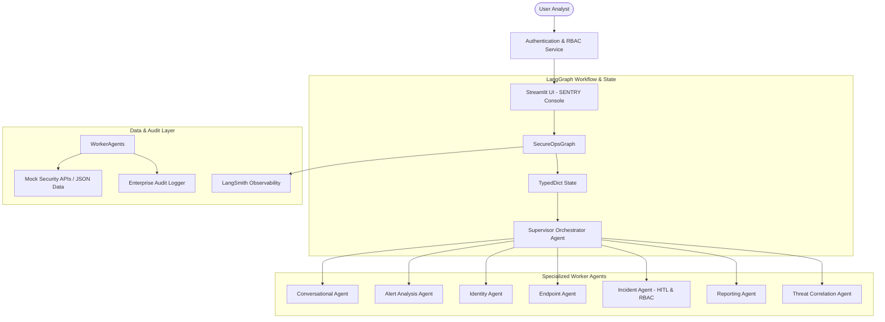

# 📐 SENTRY AI Architecture & System Design

SENTRY (**Security Engine for Next-generation Triage, Recommendations & Yield**) is built as an enterprise-grade multi-agent Security Operations Center (SOC) Copilot.

---

## 🏗️ Architectural Overview

---

## 🔒 Role-Based Access Control (RBAC) Permissions Matrix

| Action / Capability | L1 Analyst | L2 Threat Hunter | SOC Manager | CISO Executive | Admin |
|---|:---:|:---:|:---:|:---:|:---:|
| View SIEM Alerts & Logs | ✅ | ✅ | ✅ | ✅ | ✅ |
| Inspect User Identity & Logins | ✅ | ✅ | ✅ | ❌ | ✅ |
| Inspect Host Endpoint Telemetry | ✅ | ✅ | ✅ | ❌ | ✅ |
| Threat Hunting & Correlation | ❌ | ✅ | ✅ | ❌ | ❌ |
| Analyst Handoffs | ❌ | ✅ | ✅ | ❌ | ❌ |
| Incident Ticket Creation / Escalation | ❌ | ❌ | ✅ | ❌ | ❌ |
| Host EDR Network Isolation | ❌ | ❌ | ✅ | ❌ | ❌ |
| View Executive Summaries | ✅ | ✅ | ✅ | ✅ | ✅ |
| View System Compliance Audit Logs | ❌ | ✅ | ✅ | ✅ | ✅ |
